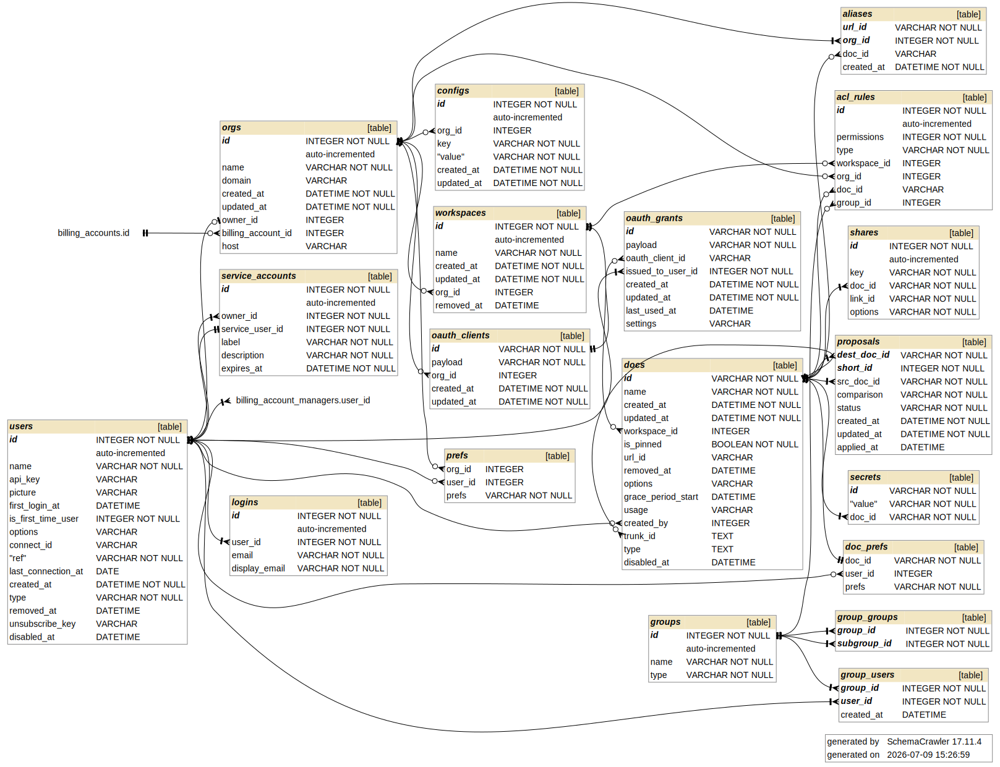
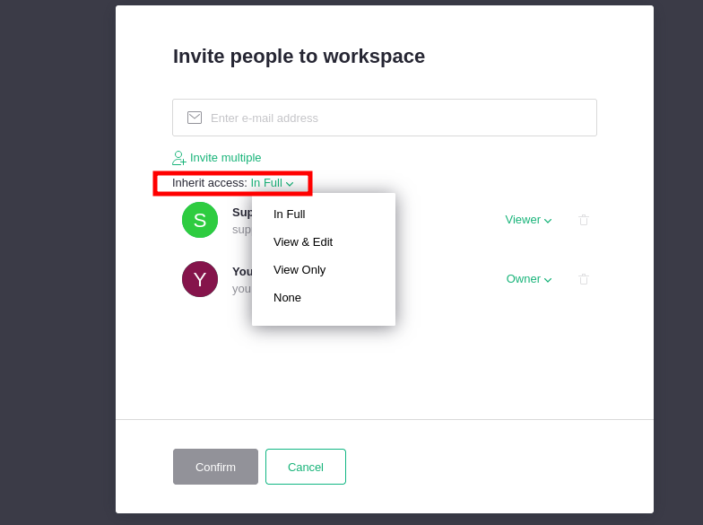

# Database

> [!WARNING]
> This documentation is meant to describe the state of the database. The reader should be aware that some undocumented changes may have been done after its last updates, and for this purpose should check the git history of this file.
>
> Also contributions are welcome! :heart:

Grist manages two databases:
1. The Home Database;
2. The Document Database (also known as "the grist document");

The Home database is responsible for things related to the instance, such as:
 - the users and the groups registered on the instance,
 - the billing,
 - the organisations (also called sites), the workspaces,
 - the documents' metadata (such as ID, name, or workspace under which it is located);
 - the access permissions (ACLs) to organisations, workspaces and documents (access to the content of the document is controlled by the document itself);

A Grist Document contains data such as:
 - The tables, pages, views data;
 - The ACL *inside* to access to all or part of tables (rows or columns);

## The Document Database

### Inspecting the Document

A Grist Document (with the `.grist` extension) is actually a SQLite database. You may download a document like [this one](https://api.getgrist.com/o/templates/api/docs/keLK5sVeyfPkxyaXqijz2x/download?template=false&nohistory=false) and inspect its content using a tool such as the `sqlite3` command:

````
$ sqlite3 Flashcards.grist
sqlite> .tables
Flashcards_Data                   _grist_TabBar
Flashcards_Data_summary_Card_Set  _grist_TabItems
GristDocTour                      _grist_TableViews
_grist_ACLMemberships             _grist_Tables
_grist_ACLPrincipals              _grist_Tables_column
_grist_ACLResources               _grist_Triggers
_grist_ACLRules                   _grist_Validations
_grist_Attachments                _grist_Views
_grist_Cells                      _grist_Views_section
_grist_DocInfo                    _grist_Views_section_field
_grist_External_database          _gristsys_Action
_grist_External_table             _gristsys_ActionHistory
_grist_Filters                    _gristsys_ActionHistoryBranch
_grist_Imports                    _gristsys_Action_step
_grist_Pages                      _gristsys_FileInfo
_grist_REPL_Hist                  _gristsys_Files
_grist_Shares                     _gristsys_PluginData
````

:warning: If you want to ensure that you will not alter a document's contents, make a backup copy beforehand.

`_grist_*` tables are managed by the data engine. Their schema is defined in [`sandbox/grist/schema.py`](/sandbox/grist/schema.py).

`_gristsys_*` tables are managed by the Node.js process. Their schema is defined in [`app/server/lib/DocStorage.ts`](/app/server/lib/DocStorage.ts).

### The migrations

For information on document database migrations, please consult [the documentation for migrations](./migrations.md#document-database).

## The Home Database

The home database may either be a SQLite or a PostgreSQL database depending on how the Grist instance has been installed. For details, please refer to the `TYPEORM_*` env variables in the [README](../README.md#database-variables).

Unless otherwise configured, the home database is a SQLite file. In the default Docker image, it is stored at this location: `/persist/home.sqlite3`.

The schema below is the same (except for minor differences in the column types), regardless of what the database type is.

### The Schema

The database schema is the following:



> [!NOTE]
> For simplicity's sake, the diagram omits the tables related to billing and to the migrations. They are documented separately in the [Billing and enterprise tables](#billing-and-enterprise-tables) section below. Recently added tables may also be missing from the diagram; when in doubt, the entity definitions in [`app/gen-server/entity/`](/app/gen-server/entity/) are the source of truth.

> [!NOTE]
> The `orgs`, `workspaces` and `docs` tables all extend the [`Resource`](/app/gen-server/entity/Resource.ts) base class, so in addition to the columns listed below they each also have:
> - `name`: The name as displayed in the UI;
> - `created_at`: When the resource was created;
> - `updated_at`: When the resource was last updated.

If you want to generate the above schema by yourself, you may run the following command using [SchemaCrawler](https://www.schemacrawler.com/) ([a docker image is available for a quick run](https://www.schemacrawler.com/docker-image.html)):
````bash
# You may adapt the --database argument to fit with the actual file name
# You may also remove the `--grep-tables` option and all that follows to get the full schema.
# database path needs to be absolute in some schemacrawler implementations
$ schemacrawler --server=sqlite --database=$(pwd)/landing.db --info-level=standard \
  --portable=names --command=schema --output-format=svg \
  --output-file=/tmp/graph.svg \
  --grep-tables="products|billing_accounts|limits|billing_account_managers|activations|migrations" \
  --invert-match
````

### `orgs` table

Stores organisations (also called "Team sites") information.

| Column name | Description |
| ------------- | -------------- |
| id | The primary key |
| name | The name as displayed in the UI |
| domain | The part that should be added in the URL |
| owner_id | If set, this is a personal org belonging to the referenced user |
| host | For custom domains, the preferred host associated with this org/team (e.g. `grist.example.com`). Null when the org is served from the default Grist host. |
| billing_account_id | The [billing account](#billing_accounts-table) this org is attached to. Every org has exactly one billing account. |

### `workspaces` table

Stores workspaces information.

| Column name | Description |
| ------------- | -------------- |
| id | The primary key |
| name | The name as displayed in the UI |
| org_id | The organisation to which the workspace belongs |
| removed_at | If not null, stores the date when the workspace has been placed in the trash (it will be hard deleted after 30 days) |

### `docs` table

Stores document information that is not portable, which means that it does not store the document data nor the ACL rules (see the "Document Database" section).

| Column name | Description |
| ------------- | -------------- |
| id | The primary key |
| name | The name as displayed in the UI |
| workspace_id | The workspace the document belongs to |
| is_pinned | Whether the document has been pinned or not |
| url_id | Short version of the `id`, as currently displayed in the URL (see the [`aliases` table](#aliases-table) for previously used values) |
| removed_at | If not null, stores the date when the document has been placed in the trash (it will be hard deleted after 30 days) |
| options | Serialized options as described in the [DocumentOptions](https://github.com/gristlabs/grist-core/blob/4567fad94787c20f65db68e744c47d5f44b932e4/app/common/UserAPI.ts#L125-L135) interface |
| created_by | The id of the [user](#users-table) who created the document (null for documents created before this column existed) |
| grace_period_start | Specific to getgrist.com. When the document first exceeds its plan's usage limits, this records the date; after the grace period elapses the document may become read-only. Null while the document is within limits. |
| disabled_at | If not null, the date at which the document was disabled (soft-disabled by an administrator, distinct from being moved to the trash) |
| usage | stats about the document (see [DocumentUsage](https://github.com/gristlabs/grist-core/blob/4567fad94787c20f65db68e744c47d5f44b932e4/app/common/DocUsage.ts)) |
| trunk_id | If set, the current document is a fork, and this column references the original ("trunk") document |
| type | If set, the current document is a special one (as specified in [DocumentType](https://github.com/gristlabs/grist-core/blob/4567fad94787c20f65db68e744c47d5f44b932e4/app/common/UserAPI.ts#L123)) |

### `aliases` table

Aliases for documents. This table lets a document keep responding to its former URLs after it has been renamed.

Whereas `docs.url_id` holds the document's *current* URL id, the `aliases` table accumulates *every* URL id that has ever pointed at the document within a given organisation. Each time a document's `url_id` changes, the previous value is kept here (and a new row is added for the new one), so that old links continue to redirect to the right document. The pair (`org_id`, `url_id`) is unique and forms the primary key.

| Column name | Description |
| ------------- | -------------- |
| url_id | A URL id (current or historical) that resolves to the document |
| org_id | The organisation the alias is scoped to |
| doc_id | The document the alias points to |
| created_at | When the alias was created (i.e. when this url_id was assigned) |

### `acl_rules` table

Permissions to access either a document, workspace or an organisation.

| Column name | Description |
| ------------- | -------------- |
| id | The primary key |
| permissions | The permissions granted to the group. See below. |
| type | Either equals to `ACLRuleOrg`, `ACLRuleWs` or `ACLRuleDoc` |
| org_id | The org id associated to this ACL (if set, workspace_id and doc_id are null) |
| workspace_id | The workspace id associated to this ACL (if set, doc_id and org_id are null) |
| doc_id | The document id associated to this ACL (if set, workspace_id and org_id are null) |
| group_id | The group of users for which the ACL applies |

<a name="acl-permissions"></a>
The permissions are stored as an integer which is read in its binary form which allows to make bitwise operations:

| Name | Value (binary) | Description |
| --------------- | --------------- | --------------- |
| VIEW | +0b00000001 | can view |
| UPDATE | +0b00000010 | can update |
| ADD | +0b00000100 | can add |
| REMOVE | +0b00001000 | can remove |
| SCHEMA_EDIT | +0b00010000 | can change schema of tables |
| ACL_EDIT | +0b00100000 | can edit the ACL (docs) or manage the teams (orgs and workspaces) of the resource |
| (reserved) | +0b01000000 | (reserved bit for the future) |
| PUBLIC | +0b10000000 | virtual bit meaning that the resource is shared publicly (not currently used) |

You notice that the permissions can be then composed:
 - EDITOR permissions = `VIEW | UPDATE | ADD | REMOVE` = `0b00000001+0b00000010+0b00000100+0b00001000` = `0b00001111` = `15`
 - ADMIN permissions = `EDITOR | SCHEMA_EDIT` = `0b00001111+0b00010000` = `0b00011111` = `31`
 - OWNER permissions = `ADMIN | ACL_EDIT` = `0b00011111+0b00100000` = `0b00111111` = `63`

For more details about that part, please refer [to the code](https://github.com/gristlabs/grist-core/blob/192e2f36ba77ec67069c58035d35205978b9215e/app/gen-server/lib/Permissions.ts).

### `secrets` table

Stores secret informations related to documents, so the document may not store them (otherwise someone who downloads a doc may access them). Used to store the unsubscribe key and the target url of Webhooks.

| Column name | Description |
| ------------- | -------------- |
| id | The primary key |
| value | The value of the secret (despite the table name, its stored unencrypted) |
| doc_id | The document id |

### `prefs` table

Stores the user's preferences. It can either be scoped globally or to an organization.

| Column name | Description |
| ------------- | -------------- |
| org_id | If set, the preferences are specific to the referenced organization. Otherwise, the user's preferences are global. |
| user_id | the user for whom preferences applies. |
| prefs | The serialized JSON of the preferences. If specific to an organization, it's [an UserOrgPrefs object](https://github.com/gristlabs/grist-core/blob/f53e2e3d6085443e173dda913fe995361d42b0f8/app/common/Prefs.ts#L41) or otherwise [an UserPrefs object](https://github.com/gristlabs/grist-core/blob/f53e2e3d6085443e173dda913fe995361d42b0f8/app/common/Prefs.ts#L17). |

### `doc_prefs` table

Stores per-document preferences. Unlike the [`prefs` table](#prefs-table) (which is scoped to a user, optionally per org), these preferences belong to a document.

| Column name | Description |
| ------------- | -------------- |
| doc_id | The document the preferences apply to |
| user_id | If null, these are the document's *default* preferences (shared by everyone). If set, these are the given user's overrides for the document. |
| prefs | The serialized JSON of the preferences (a [DocPrefs object](https://github.com/gristlabs/grist-core/blob/main/app/common/Prefs.ts)) |

### `shares` table

Stores special grants for documents for anyone having the key.

| Column name | Description |
| ------------- | -------------- |
| id | The primary key |
| key | A long string secret to identify the share. Suitable for URLs. Unique across the database / installation. |
| link_id | A string to identify the share. This identifier is common to the home database and the document specified by docId. It need only be unique within that document, and is not a secret. |
| doc_id | The document to which the share belongs |
| options | Any overall qualifiers on the share |

For more information, please refer [to the comments in the code](https://github.com/gristlabs/grist-core/blob/f53e2e3d6085443e173dda913fe995361d42b0f8/app/gen-server/entity/Share.ts).

### `proposals` table

Tracks proposed changes between documents, in a "GitHub pull request"-like fashion. Each proposal has a source document (holding the proposed changes) and a destination document, which are assumed to share a common ancestor. Users of the destination document can be offered the changes and merge them in.

| Column name | Description |
| ------------- | -------------- |
| src_doc_id | The source document containing the proposed changes (part of the primary key) |
| dest_doc_id | The destination document the changes are proposed to (part of the primary key) |
| short_id | A small incrementing integer, unique per destination document, used to identify the proposal in the UI (like a PR number) |
| comparison | The diff between the documents, in the format used by the `/compare` endpoint (see [ProposalComparison](https://github.com/gristlabs/grist-core/blob/main/app/common/UserAPI.ts)) |
| status | The proposal status, e.g. dismissed, retracted or applied (see [ProposalStatus](https://github.com/gristlabs/grist-core/blob/main/app/common/UserAPI.ts)) |
| created_at | When the proposal was created |
| updated_at | When the proposal was last updated |
| applied_at | When the proposal was applied, or null if it has not been applied |

> [!NOTE]
> Currently only a single proposal is permitted between a given source/destination pair. See the [comments in the code](https://github.com/gristlabs/grist-core/blob/main/app/gen-server/entity/Proposal.ts) for the caveats and open questions around this feature.

### `groups` table

The groups are entities that may contain either other groups and/or users.

| Column name   | Description    |
|--------------- | --------------- |
| id | The primary key   |
| name   | The name (for role groups, one of the 5 role names below) |
| type   | Either `role` or `team` (see below). Role groups back the ACL role of a resource; team groups gather users so they can be granted a role together. |

There are two kinds of groups, distinguished by the `type` column:
 - **role** groups (`type = 'role'`): these back the per-resource roles and are the historical use of this table (described below);
 - **team** groups (`type = 'team'`): these gather users together so the whole set can be granted the same access (through a role) to some resources. A unique index enforces that team names are unique. Team groups cannot contain other groups.

For role groups, only 5 names exist, which correspond to Roles (for the permissions, please refer to the [ACL rules permissions details](#acl-permissions)):
 - `owners` (see the `OWNER` permissions)
 - `editors` (see the `EDITOR` permissions)
 - `viewers` (see the `VIEW` permissions)
 - `members`
 - `guests`

`viewers`, `members` and `guests` all have the same effective rights (viewer-level), the only difference between them is their purpose:
 - `viewers` are explicitly allowed to view the resource and its descendants;
 - `members` are specific to organisations and are meant to allow access to be granted to individual documents or workspaces, rather than the full team site;
 - `guests` is an automatically-managed group: when a user is granted access to a child resource (e.g. a single document) but not to its parent (the workspace or org), Grist adds them to the parent's `guests` group so they retain just enough (view) access to navigate down to the resource they can actually use. Guests are never assigned directly; Grist repairs this group whenever access on a child resource changes.

Each time a resource is created, the role groups above are created (except `members`, which is specific to organisations).

### `group_groups` table

The table which allows groups to contain other groups. It is also used for the inheritance mechanism (see below).

| Column name   | Description    |
|--------------- | --------------- |
| group_id | The id of the group containing the subgroup |
| subgroup_id   | The id of the subgroup |

### `group_users` table

The table which assigns users to groups.

| Column name   | Description    |
|--------------- | --------------- |
| group_id | The id of the group containing the user |
| user_id   | The id of the user |
| created_at | datetime where the user was added to a group |

### `groups`, `group_groups`, `group_users` and inheritances

We mentioned earlier that the groups currently holds the roles with the associated permissions.

The database stores the inheritances of rights as described below.

Let's imagine that a user is granted the role of *Owner* for the "Org1" organisation, s/he therefore belongs to the group "Org1 Owners" (whose ID is `id_org1_owner_grp`) which also belongs to the "WS1 Owners" (whose ID is `id_ws1_owner_grp`) by default. In other words, this user is by default owner of both the Org1 organization and of the WS1 workspace.

The below schema illustrates both the inheritance of between the groups and the state of the database:

 <!-- Use diagrams.net and import ./images/BDD.drawio to edit this image -->

This inheritance can be changed through the Users management popup in the Contextual Menu for the Workspaces:



If you change the inherit access to "View Only", here is what happens:

 <!-- Use diagrams.net and import ./images/BDD.drawio to edit this image -->

The Org1 owners now belongs to the "WS1 Viewers" group, and the user despite being *Owner* of "Org1" can only view the workspace WS1 and its documents because s/he only gets the Viewer role for this workspace. Regarding the database, `group_groups` which holds the group inheritance has been updated, so the parent group for `id_org1_owner_grp` is now `id_ws1_viewers_grp`.

### `users` table

Stores `users` information.

| Column name | Description |
|--------------- | --------------- |
| id | The primary key |
| name | The user's name |
| api_key | If generated, the [HTTP API Key](https://support.getgrist.com/rest-api/) used to authenticate the user |
| picture | The URL to the user's picture (must be provided by the SSO Identity Provider) |
| first_login_at | The date of the first login |
| last_connection_at | The date of the last time the user has signed in to Grist |
| disabled_at | If not null, the date at which the user was disabled |
| is_first_time_user | Whether the user discovers Grist (used to trigger the Welcome Tour) |
| options | Serialized options as described in [UserOptions](https://github.com/gristlabs/grist-core/blob/513e13e6ab57c918c0e396b1d56686e45644ee1a/app/common/UserAPI.ts#L169-L179) interface |
| connect_id | Used by [GristConnect](https://support.getgrist.com/install/grist-connect/) in the full edition of Grist to identify user in external provider |
| ref | A unique reference for the user, generated at insert time. Primarily used as an ownership key in cell metadata (comments); also handy to identify a user in the automated tests. |
| created_at | When the user record was created |
| unsubscribe_key | A random public key that lets the user manage document notification preferences without authenticating (e.g. from an "unsubscribe" link in an email) |
| type | The kind of user: `login` for a regular human user, or `service` for a [service account](#service_accounts-table) |

### `logins` table

Stores information related to the identification.

> [!NOTE]
> A user may have many `logins` records associated to him/her, like several emails used for identification.


| Column name | Description |
|--------------- | --------------- |
| id | The primary key |
| user_id | The user's id |
| email | The normalized email address used for equality and indexing (specifically converted to lower case) |
| display_email | The user's email address as displayed in the UI |

### `service_accounts` table

Service accounts allow non-human, programmatic access to Grist (for example an integration authenticating with an API key). A service account is owned by a regular user and is itself backed by a dedicated [user](#users-table) record whose `type` is `service` (its login email always ends in `@serviceaccounts.invalid`).

| Column name | Description |
| ------------- | -------------- |
| id | The primary key |
| owner_id | The id of the [user](#users-table) who owns (created and manages) this service account |
| service_user_id | The id of the [user](#users-table) record that represents the service account itself |
| label | A human-readable label for the service account |
| description | A free-form description |
| expires_at | The date at which the service account expires and stops authenticating |

### `configs` table

Stores configuration key/value pairs. A config may be global (org id is null) or scoped to a specific organisation.

| Column name | Description |
| ------------- | -------------- |
| id | The primary key |
| org_id | If set, the organisation this config applies to; null for a global config |
| key | The configuration key (see [ConfigKey](https://github.com/gristlabs/grist-core/blob/main/app/common/Config.ts)) |
| value | The serialized JSON value (see [ConfigValue](https://github.com/gristlabs/grist-core/blob/main/app/common/Config.ts)) |
| created_at | When the config was created |
| updated_at | When the config was last updated |

### `oauth_clients` and `oauth_grants` tables

These tables support Grist acting as an OAuth/OIDC provider, e.g. so a self-hosted instance can offer "Sign in with getgrist.com". They are managed via the [`oidc-provider`](https://github.com/panva/node-oidc-provider) library, so their `payload` columns store that library's own structures verbatim.

`oauth_clients` stores the registered OAuth clients:

| Column name | Description |
| ------------- | -------------- |
| id | The client id (primary key) |
| payload | The client metadata, as understood by `oidc-provider` (stored as JSONB) |
| org_id | The org that owns the client (currently always a personal org), or null for dynamically-registered (DCR) clients that have no owner. When the owning org is deleted, the client is deleted too. |
| created_at | When the client was created |
| updated_at | When the client was last updated |

`oauth_grants` records a user's consent granting a client access to certain scopes/claims. A client may have at most one grant per user.

| Column name | Description |
| ------------- | -------------- |
| id | The grant id (primary key) |
| payload | The grant data, as understood by `oidc-provider` (stored as JSONB) |
| settings | Grist-owned per-grant configuration, kept separate from `payload` because `oidc-provider` only allows recognized fields there |
| oauth_client_id | The [client](#oauth_clients-and-oauth_grants-tables) the grant is for, or null for CIMD (Client ID Metadata Document) clients that have no Grist-side record |
| issued_to_user_id | The [user](#users-table) the grant was issued to |
| created_at | When the grant was created |
| updated_at | When the grant was last updated |
| last_used_at | When an access token was last issued for this grant (a proxy for "the app is still active"), or null if never |

## Billing and enterprise tables

The following tables support billing (on getgrist.com and other managed deployments) and enterprise activation. For simplicity they are **not** shown on the schema diagram above.

### `products` table

A product is a named bundle of enabled features (row limits, attachment quotas, whether workspaces are available, etc.). Grist knows about the free products and creates them by default; other products are created and synchronized by the billing system (Stripe).

| Column name | Description |
| ------------- | -------------- |
| id | The primary key |
| name | The product name, e.g. `Free`, `teamFree`, `team`, `suspended`, `stub` |
| features | The serialized JSON set of enabled features (see [Features](https://github.com/gristlabs/grist-core/blob/main/app/common/Features.ts)) |

### `billing_accounts` table

Relates organisations to a [product](#products-table) and holds the information needed to update and pay for it. There is exactly one billing account per organisation (see `orgs.billing_account_id`).

| Column name | Description |
| ------------- | -------------- |
| id | The primary key |
| product_id | The [product](#products-table) that applies to this account |
| features | Optional per-account feature overrides, merged over the product's features |
| individual | Whether this account is for an individual (personal org) |
| in_good_standing | A flag for when all is well with the user's subscription |
| status | Serialized JSON billing status (see [BillingAccountStatus](https://github.com/gristlabs/grist-core/blob/main/app/common/UserAPI.ts)) |
| stripe_customer_id | The Stripe customer id, if any |
| stripe_subscription_id | The Stripe subscription id, if any |
| stripe_plan_id | The Stripe plan id, if any |
| payment_link | A link to the payment page, if any |
| external_id | An id for accounts billed by an external authority (outside Grist's regular flow) |
| external_options | Serialized JSON options for external billing (authority name, invoice id, ...) |

### `billing_account_managers` table

Lists the users allowed to view and modify a given billing account.

| Column name | Description |
| ------------- | -------------- |
| id | The primary key |
| billing_account_id | The [billing account](#billing_accounts-table) being managed |
| user_id | The [user](#users-table) who may manage it |

### `limits` table

Tracks usage against a metered limit for a billing account (for example the number of AI assistant calls).

| Column name | Description |
| ------------- | -------------- |
| id | The primary key |
| billing_account_id | The [billing account](#billing_accounts-table) the limit belongs to |
| type | The kind of limit (e.g. the assistant call limit) |
| limit | The maximum allowed value |
| usage | The current usage against the limit |
| created_at | When the limit was created |
| changed_at | When the `limit` value was last changed (by an upgrade or downgrade), or null if never |
| used_at | When the usage was last incremented, or null if never |
| reset_at | When the usage was last reset (e.g. at a billing cycle change), or null if never |

### `activations` table

Records the activation of a Grist installation. Even Grist Core installations create an activation row to store installation-level preferences; enterprise deployments additionally use it to track the enterprise key and trial/grace period.

| Column name | Description |
| ------------- | -------------- |
| id | The primary key |
| key | The enterprise activation key, if any |
| prefs | Serialized JSON installation preferences (see [InstallPrefs](https://github.com/gristlabs/grist-core/blob/main/app/common/Install.ts)) |
| enabled_at | When enterprise activation was first enabled (so the trial date can be counted from then), or null |
| grace_period_start | When the installation entered a grace period due to key expiration or exceeded limits, or null |
| created_at | When the activation was created |
| updated_at | When the activation was last updated |

### The migrations

For information on home database migrations, please consult [the documentation for migrations](./migrations.md#home-database).

