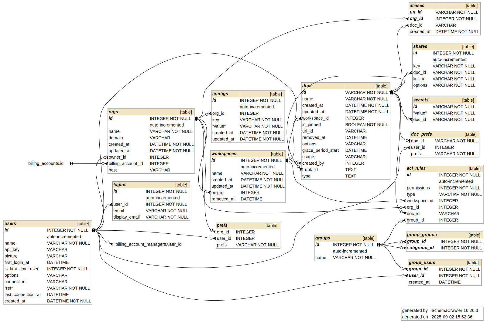

# Database

> [!WARNING]
> This documentation is meant to describe the state of the database. The reader should be aware that some undocumented changes may have been done after its last updates, and for this purpose should check the git history of this file.
>
> Also contributions are welcome! :heart:

Grist manages two databases:
1. The Home Database;
2. The Document Database (also known as "the grist document");

The Home database is responsible for things related to the instance, such as:
 - the users and the groups registered on the instance,
 - the billing,
 - the organisations (also called sites), the workspaces,
 - the documents' metadata (such as ID, name, or workspace under which it is located);
 - the access permissions (ACLs) to organisations, workspaces and documents (access to the content of the document is controlled by the document itself);

A Grist Document contains data such as:
 - The tables, pages, views data;
 - The ACL *inside* to access to all or part of tables (rows or columns);

## The Document Database

### Inspecting the Document

A Grist Document (with the `.grist` extension) is actually a SQLite database. You may download a document like [this one](https://api.getgrist.com/o/templates/api/docs/keLK5sVeyfPkxyaXqijz2x/download?template=false&nohistory=false) and inspect its content using a tool such as the `sqlite3` command:

````
$ sqlite3 Flashcards.grist
sqlite> .tables
Flashcards_Data                   _grist_TabBar
Flashcards_Data_summary_Card_Set  _grist_TabItems
GristDocTour                      _grist_TableViews
_grist_ACLMemberships             _grist_Tables
_grist_ACLPrincipals              _grist_Tables_column
_grist_ACLResources               _grist_Triggers
_grist_ACLRules                   _grist_Validations
_grist_Attachments                _grist_Views
_grist_Cells                      _grist_Views_section
_grist_DocInfo                    _grist_Views_section_field
_grist_External_database          _gristsys_Action
_grist_External_table             _gristsys_ActionHistory
_grist_Filters                    _gristsys_ActionHistoryBranch
_grist_Imports                    _gristsys_Action_step
_grist_Pages                      _gristsys_FileInfo
_grist_REPL_Hist                  _gristsys_Files
_grist_Shares                     _gristsys_PluginData
````

:warning: If you want to ensure that you will not alter a document's contents, make a backup copy beforehand.

### The migrations

The migrations are handled in the Python sandbox in [`sandbox/grist/migrations.py`](../sandbox/grist/migrations.py).

For more information, please consult [the documentation for migrations](./migrations.md).

## The Home Database

The home database may either be a SQLite or a PostgreSQL database depending on how the Grist instance has been installed. For details, please refer to the `TYPEORM_*` env variables in the [README](../README.md#database-variables).

Unless otherwise configured, the home database is a SQLite file. In the default Docker image, it is stored at this location: `/persist/home.sqlite3`.

The schema below is the same (except for minor differences in the column types), regardless of what the database type is.

### The Schema

The database schema is the following:



> [!NOTE]
> For simplicity's sake, we have removed tables related to the billing and to the migrations.

If you want to generate the above schema by yourself, you may run the following command using [SchemaCrawler](https://www.schemacrawler.com/) ([a docker image is available for a quick run](https://www.schemacrawler.com/docker-image.html)):
````bash
# You may adapt the --database argument to fit with the actual file name
# You may also remove the `--grep-tables` option and all that follows to get the full schema.
$ schemacrawler --server=sqlite --database=landing.db --info-level=standard \
  --portable-names --command=schema --output-format=svg \
  --output-file=/tmp/graph.svg \
  --grep-tables="products|billing_accounts|limits|billing_account_managers|activations|migrations" \
  --invert-match
````

### `orgs` table

Stores organisations (also called "Team sites") information.

| Column name | Description |
| ------------- | -------------- |
| id | The primary key |
| name | The name as displayed in the UI |
| domain | The part that should be added in the URL |
| owner | The id of the user who owns the org |
| host | ??? |

### `workspaces` table

Stores workspaces information.

| Column name | Description |
| ------------- | -------------- |
| id | The primary key |
| name | The name as displayed in the UI |
| org_id | The organisation to which the workspace belongs |
| removed_at | If not null, stores the date when the workspaces has been placed in the trash (it will be hard deleted after 30 days) |


### `docs` table

Stores document information that is not portable, which means that it does not store the document data nor the ACL rules (see the "Document Database" section).

| Column name | Description |
| ------------- | -------------- |
| id | The primary key |
| name | The name as displayed in the UI |
| workspace_id | The workspace the document belongs to |
| is_pinned | Whether the document has been pinned or not |
| url_id | Short version of the `id`, as displayed in the URL |
| removed_at | If not null, stores the date when the workspaces has been placed in the trash (it will be hard deleted after 30 days) |
| options | Serialized options as described in the [DocumentOptions](https://github.com/gristlabs/grist-core/blob/4567fad94787c20f65db68e744c47d5f44b932e4/app/common/UserAPI.ts#L125-L135) interface |
| grace_period_start | Specific to getgrist.com (TODO describe it) |
| usage | stats about the document (see [DocumentUsage](https://github.com/gristlabs/grist-core/blob/4567fad94787c20f65db68e744c47d5f44b932e4/app/common/DocUsage.ts)) |
| trunk_id | If set, the current document is a fork (only from a tutorial), and this column references the original document |
| type | If set, the current document is a special one (as specified in [DocumentType](https://github.com/gristlabs/grist-core/blob/4567fad94787c20f65db68e744c47d5f44b932e4/app/common/UserAPI.ts#L123)) |

### `aliases` table

Aliases for documents.

FIXME: What's the difference between `docs.url_id` and `alias.url_id`?

| Column name | Description |
| ------------- | -------------- |
| url_id | The URL alias for the doc_id |
| org_id | The organisation the document belongs to |
| doc_id | The document id |

### `acl_rules` table

Permissions to access either a document, workspace or an organisation.

| Column name | Description |
| ------------- | -------------- |
| id | The primary key |
| permissions | The permissions granted to the group. See below. |
| type | Either equals to `ACLRuleOrg`, `ACLRuleWs` or `ACLRuleDoc` |
| org_id | The org id associated to this ACL (if set, workspace_id and doc_id are null) |
| workspace_id | The workspace id associated to this ACL (if set, doc_id and org_id are null) |
| doc_id | The document id associated to this ACL (if set, workspace_id and org_id are null) |
| group_id | The group of users for which the ACL applies |

<a name="acl-permissions"></a>
The permissions are stored as an integer which is read in its binary form which allows to make bitwise operations:

| Name | Value (binary) | Description |
| --------------- | --------------- | --------------- |
| VIEW | +0b00000001 | can view |
| UPDATE | +0b00000010 | can update |
| ADD | +0b00000100 | can add |
| REMOVE | +0b00001000 | can remove |
| SCHEMA_EDIT | +0b00010000 | can change schema of tables |
| ACL_EDIT | +0b00100000 | can edit the ACL (docs) or manage the teams (orgs and workspaces) of the resource |
| (reserved) | +0b01000000 | (reserved bit for the future) |
| PUBLIC | +0b10000000 | virtual bit meaning that the resource is shared publicly (not currently used) |

You notice that the permissions can be then composed:
 - EDITOR permissions = `VIEW | UPDATE | ADD | REMOVE` = `0b00000001+0b00000010+0b00000100+0b00001000` = `0b00001111` = `15`
 - ADMIN permissions = `EDITOR | SCHEMA_EDIT` = `0b00001111+0b00010000` = `0b00011111` = `31`
 - OWNER permissions = `ADMIN | ACL_EDIT` = `0b00011111+0b00100000` = `0b0011111` = `63`

For more details about that part, please refer [to the code](https://github.com/gristlabs/grist-core/blob/192e2f36ba77ec67069c58035d35205978b9215e/app/gen-server/lib/Permissions.ts).

### `secrets` table

Stores secret informations related to documents, so the document may not store them (otherwise someone who downloads a doc may access them). Used to store the unsubscribe key and the target url of Webhooks.

| Column name | Description |
| ------------- | -------------- |
| id | The primary key |
| value | The value of the secret (despite the table name, its stored unencrypted) |
| doc_id | The document id |

### `prefs` table

Stores special grants for documents for anyone having the key.

| Column name | Description |
| ------------- | -------------- |
| id | The primary key |
| key | A long string secret to identify the share. Suitable for URLs. Unique across the database / installation. |
| link_id | A string to identify the share. This identifier is common to the home database and the document specified by docId. It need only be unique within that document, and is not a secret. | doc_id | The document to which the share belongs |
| options | Any overall qualifiers on the share |

For more information, please refer [to the comments in the code](https://github.com/gristlabs/grist-core/blob/192e2f36ba77ec67069c58035d35205978b9215e/app/gen-server/entity/Share.ts).

### `groups` table

The groups are entities that may contain either other groups and/or users.

| Column name   | Description    |
|--------------- | --------------- |
| id | The primary key   |
| name   | The name (see the 5 types of groups below) |

Only 5 types of groups exist, which corresponds actually to Roles (for the permissions, please refer to the [ACL rules permissions details](#acl-permissions)):
 - `owners` (see the `OWNERS` permissions)
 - `editors` (see the `EDITORS` permissions)
 - `viewers` (see the `VIEWS` permissions)
 - `members`
 - `guests`

`viewers`, `members` and `guests` have basically the same rights (like viewers), the only difference between them is that:
 - `viewers` are explicitly allowed to view the resource and its descendants;
 - `members` are specific to the organisations and are meant to allow access to be granted to individual documents or workspaces, rather than the full team site.
 - `guests` are (FIXME: help please on this one :))

Each time a resource is created, the groups corresponding to the roles above are created (except the `members` which are specific to organisations).

### `group_groups` table

The table which allows groups to contain other groups. It is also used for the inheritance mechanism (see below).

| Column name   | Description    |
|--------------- | --------------- |
| group_id | The id of the group containing the subgroup |
| subgroup_id   | The id of the subgroup |

### `group_users` table

The table which assigns users to groups.

| Column name   | Description    |
|--------------- | --------------- |
| group_id | The id of the group containing the user |
| user_id   | The id of the user |

### `groups`, `group_groups`, `group_users` and inheritances

We mentioned earlier that the groups currently holds the roles with the associated permissions.

The database stores the inheritances of rights as described below.

Let's imagine that a user is granted the role of *Owner* for the "Org1" organisation, s/he therefore belongs to the group "Org1 Owners" (whose ID is `id_org1_owner_grp`) which also belongs to the "WS1 Owners" (whose ID is `id_ws1_owner_grp`) by default. In other words, this user is by default owner of both the Org1 organization and of the WS1 workspace.

The below schema illustrates both the inheritance of between the groups and the state of the database:

 <!-- Use diagrams.net and import ./images/BDD.drawio to edit this image -->

This inheritance can be changed through the Users management popup in the Contextual Menu for the Workspaces:


If you change the inherit access to "View Only", here is what happens:

 <!-- Use diagrams.net and import ./images/BDD.drawio to edit this image -->

The Org1 owners now belongs to the "WS1 Viewers" group, and the user despite being *Owner* of "Org1" can only view the workspace WS1 and its documents because s/he only gets the Viewer role for this workspace. Regarding the database, `group_groups` which holds the group inheritance has been updated, so the parent group for `id_org1_owner_grp` is now `id_ws1_viewers_grp`.

### `users` table

Stores `users` information.

| Column name | Description |
|--------------- | --------------- |
| id | The primary key |
| name | The user's name |
| api_key | If generated, the [HTTP API Key](https://support.getgrist.com/rest-api/) used to authenticate the user |
| picture | The URL to the user's picture (must be provided by the SSO Identity Provider) |
| first_login_at | The date of the first login |
| is_first_time_user | Whether the user discovers Grist (used to trigger the Welcome Tour) |
| options | Serialized options as described in [UserOptions](https://github.com/gristlabs/grist-core/blob/513e13e6ab57c918c0e396b1d56686e45644ee1a/app/common/UserAPI.ts#L169-L179) interface |
| connect_id | Used by [GristConnect](https://github.com/gristlabs/grist-ee/blob/5ae19a7dfb436c8a3d67470b993076e51cf83f21/ext/app/server/lib/GristConnect.ts) in Enterprise Edition to identify user in external provider |
| ref | Used to identify a user in the automated tests |

### `logins` table

Stores information related to the identification.

> [!NOTE]
> A user may have many `logins` records associated to him/her, like several emails used for identification.


| Column name | Description |
|--------------- | --------------- |
| id | The primary key |
| user_id | The user's id |
| email | The normalized email address used for equality and indexing (specifically converted to lower case) |
| display_email | The user's email address as displayed in the UI |

### The migrations

The database migrations are handled by TypeORM ([documentation](https://typeorm.io/migrations)). The migration files are located at [`app/gen-server/migration`](../app/gen-server/migration) and are run at startup (so you don't have to worry about running them yourself).
