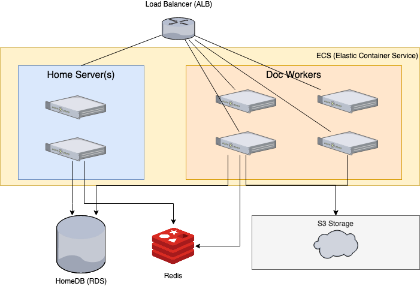
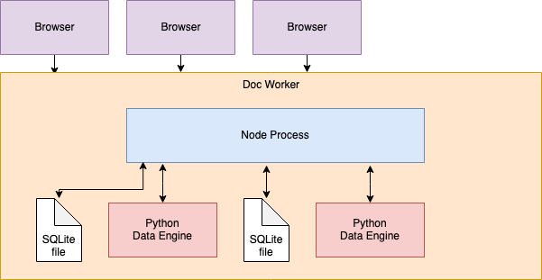

# Overview of Grist Components

## Example Setup

Grist can be run as a single server, or as a composition of several. Here we describe a scalable setup used by Grist Labs. A single server would work fine for most individual organizations running Grist, but the concepts are still useful when working on the codebase.



Grist Labs runs Grist as two primary kinds of servers: Home Servers and Doc Workers.

* **Home Servers:** handle most user requests around documents, such as listing documents, checking access and sharing, handling API requests (forwarding to Doc Worker if needed), and more.
* **Doc Workers:** responsible for in-document interactions. Each open document is assigned to a single Doc Worker. This Doc Worker has a local copy of the corresponding SQLite file containing the document data, and spawns a sandboxed python interpreter responsible for evaluating formulas in the document (the “data engine”).

For load balancing, Application Load Balancer (ALB) is used.

* **ALB:** Application Load Balancer handles SSL, and forwards HTTP requests to Home Servers and in some cases (mainly for websockets) to Doc Workers.

For storage, Home Servers and Doc Workers rely on HomeDB, Redis, and S3.

* **Home DB:** Postgres database (AWS RDS) containing information about users, orgs, workspaces, documents, sharing, and billing.
* **S3:** used for long-term storage of documents. It is primarily used by Doc Workers, which fetch SQLite files from S3 when a doc gets opened, and sync back SQLite files regularly as the document is modified by the user. Grist also supports other S3-compatible stores through [MinIO](https://support.getgrist.com/install/cloud-storage/#s3-compatible-stores-via-minio-client).
* **Redis:** Redis instance (AWS ElastiCache) keeps track of which Doc Workers are available, and which open documents are assigned to which Doc Workers.

### Home Servers

Home Servers have just one node process. They communicate with HomeDB, Redis, and Doc Workers. They don’t open documents or start subprocesses. Browser clients interact with them using plain HTTP requests.

Home Servers also serve static files (e.g. the JS bundle with the entirety of the client-side app), and can be configured to serve assets from an external source (e.g. AWS CloudFront and S3).

### Doc Workers

Doc Workers deal with documents. They bring documents (SQLite files) from S3 to local disk, start a sandboxed Python interpreter for each one, and communicate with it to apply changes to a document. Browsers interact with Doc Workers directly via websockets. When browsers make doc-specific HTTP API requests, those get forwarded to Doc Workers via Home Servers.



## Loading Documents

When a user opens a document, the Home Server is responsible for picking a Doc Worker. Once a document is assigned to a Doc Worker, other users (browser tabs) opening the same document will be serviced by the same worker.

When a Doc Worker is assigned a document, it brings a copy of the backing SQLite file (also known as `.grist` file) from S3 to local disk. It instantiates an ActiveDoc object in Node, which connects various components while the document is open.

On open, Doc Worker starts up a data engine process. This is a Python process, executed in a sandboxed environment because it runs user formulas (which can be arbitrary Python code). This process remains active as long as the doc is open on this Doc Worker.

On open, all document data gets read from SQLite file and loaded into the Python data engine. The data engine doesn’t have direct access to the SQLite file. (Loading data fully into memory is limiting and not great, but that’s what happens today. There is one exception: tables marked as [“on-demand” tables](https://support.getgrist.com/on-demand-tables/) are not loaded into the data engine.)

A typical client, from Grist’s point of view, is a browser tab or an API client. A browser tab differs from an API client by communicating via a websocket, and receiving updates when data changes. Calls from either kind of client are translated into method calls on [ActiveDoc](#server-side).

When a doc is opened, the browser requests the full content of metadata tables (these are all the tables starting with the `_grist_` prefix). Other tables are fetched in full when needed to display data. Once fetched, data is maintained in memory in the browser using the updates that come via websocket. In practice, this means that data is fully in memory, once in the Python data engine, and also in the Javascript environment of each tab that has the document open. (Again, on-demand tables are an exception.)

## Changes to documents

A user-initiated change to a document is sent to the server as a **User Action**. Most of these are simple data changes such as `UpateRecord`, `AddRecord`, `RenameTable`, etc. There are some fancier ones like `CreateViewSection`. Here is a typical life of a User Action:

* Created in the frontend client as the effect of some actual action by the user, like typing into a cell.
* Sent from the client to Node via WebSocket.
* Forwarded from Node to Python data engine.
* Converted by Python data engine into a series of **Doc Actions**. Doc Actions are only simple data or schema changes. These include results of formula calculations. These Doc Actions update the in-memory representation of the doc inside the data engine, and get returned to Node.
* Node translates Doc Actions to SQL to update the local SQLite file. (It also periodically syncs this file to S3.)
* Node forwards the Doc Actions to all browsers connected via websocket, including the client that sent the action originally. All clients update their in-memory representation of the doc using these Doc Actions.
* Node responds to the original client with return value of the action (e.g. rowId of an added record).

The authoritative list of available User Actions is the list of all the methods of `sandbox/grist/useractions.py` with `@useraction` decorator.

Doc Actions are handled both in Python and Node. Here is the full list of Doc Actions:

```
// Data Actions
export type AddRecord = ['AddRecord', string, number, ColValues];
export type BulkAddRecord = ['BulkAddRecord', string, number[], BulkColValues];
export type RemoveRecord = ['RemoveRecord', string, number];
export type BulkRemoveRecord = ['BulkRemoveRecord', string, number[]];
export type UpdateRecord = ['UpdateRecord', string, number, ColValues];
export type BulkUpdateRecord = ['BulkUpdateRecord', string, number[], BulkColValues];

export type ReplaceTableData = ['ReplaceTableData', string, number[], BulkColValues];

// This is the format in which data comes when we fetch a table from the sandbox.
export type TableDataAction = ['TableData', string, number[], BulkColValues];

// Schema Actions
export type AddColumn = ['AddColumn', string, string, ColInfo];
export type RemoveColumn = ['RemoveColumn', string, string];
export type RenameColumn = ['RenameColumn', string, string, string];
export type ModifyColumn = ['ModifyColumn', string, string, ColInfo];

export type AddTable = ['AddTable', string, ColInfoWithId[]];
export type RemoveTable = ['RemoveTable', string];
export type RenameTable = ['RenameTable', string, string];
```

Data actions take a numeric `rowId` (or a list of them, for “bulk” actions) and a set of values:

```
export interface ColValues { [colId: string]: CellValue; }
export interface BulkColValues { [colId: string]: CellValue[]; }
```

In case of “bulk” actions, note that the values are column oriented.

Note also that all Doc Actions are themselves valid User Actions, i.e. User Actions are a superset of Doc Actions. User Actions, however, are less strict. For example, the User Actions `AddRecord` is typically used with a rowId of `null`; on processing it, the data engine picks the next unused rowId, and produces a similar `AddRecord` Doc Action, with an actual number for rowId.

## Codebase Overview

### Server Side

Most server code lives in **`app/server`**.

* `app/server/lib/`**`FlexServer.ts`**
    Sets up Express endpoints and initializes all other components to run the home server or doc worker or to serve static files. Hence the “Flex” in the name. The home servers and doc workers run using the same code, and parameters and environment variables determine which type of server it will be. It’s possible to run all servers in the same process.
* `app/server/lib/`**`ActiveDoc.ts`**
    The central dispatcher for everything related to an open document — it connects NSandbox, DocStorage, GranularAccess components (described below), as well as connected clients, and shuttles user actions and doc actions between them.
* `app/server/lib/`**`GranularAccess.ts`**
    Responsible for granular access control. It checks user actions coming from clients before they are sent to the data engine, then again after the data engine translates them (reversing them if needed), and filters what gets sent to the clients based on what they have permission to see.
* `app/server/lib/`**`NSandbox.ts`**
    Starts a subprocess with a sandboxed Python process running the data engine, and sets up pipes to and from it to allow making RPC-like calls to the data engine.
* `app/server/lib/`**`DocStorage.ts`**
    Responsible for storing Grist data in a SQLite file. It satisfies fetch requests by retrieving data from SQLite, and knows how to translate every Doc Action into suitable SQL updates.
* `app/server/lib/`**`HostedStorageManager.ts`**
    Responsible for getting files to and from storage, syncing docs to S3 (or an S3-compatible store) when they change locally, and creating and pruning snapshots.

Some code related to the Home DB lives in **`app/gen-server`**.

* `app/gen-server/lib/`**`HomeDBManager.ts`**
    Responsible for dealing with HomeDB: it handles everything related to sharing, as well as finding, listing, updating docs, workspaces, and orgs (aka “team sites”). It also handles authorization needs — checking what objects a user is allowed to access, looking up users by email, etc.

### Common

The **`app/common`** directory contains files that are included both in the server-side, and in the client-side JS bundle. It’s an assortment of utilities, libraries, and typings.

* `app/common/`**`TableData.ts`**
    Maintains data of a Grist table in memory, and knows how to apply Doc Actions to it to keep it up-to-date.
* `app/common/`**`DocData.ts`**
    Maintains a set of TableData objects, in other words all data for a Grist document, including the logic for applying Doc Actions to keep the in-memory data up-to-date.
* `app/common/`**`gutil.ts`**
    Assorted functions and helpers like `removePrefix`, `countIf`, or `sortedIndex`.

### Client Side

Much of the application is on the browser side. The code for that all lives in `app/client`. It uses some lower-level libraries for working with DOM, specifically GrainJS (https://github.com/gristlabs/grainjs#documentation). Older code uses knockout and some library files that are essentially a precursor to GrainJS. These live in `app/client/lib`. See also [GrainJS & Grist Front-End Libraries](grainjs.md).

* **`app/client/models`**
    Contains modules responsible for maintaining client-side data.
    * `app/client/models/`**`TableData.ts`**, `app/client/models/`**`DocData.ts`**
        Enhancements of same-named classes in `app/common` (see above) which add some client-side functionality like helpers to send User Actions.
    * `app/client/models/`**`DocModel.ts`**
        Maintains *observable* data models, for all metadata and user data tables in a document. For metadata tables, the individual records are enhanced to be specific to each type of metadata, using classes in `app/client/models/entities`. For example, `docModel.columns` is a `MetaTableModel` containing records of type `ColumnRec` (from `app/client/models/entities/ColumnRec.ts`) which are derived from `MetaRowModel`.
    * `app/client/models/`**`TableModel.js`**
        Base class for `MetaTableModel` and `DataTableModel`. It wraps `TableData` to make the data observable, i.e. to make it possible to subscribe to changes in it. This is the basis for how we build most UI.
    * `app/client/models/`**`MetaTableModel.js`**
        Maintains data for a metadata table, making it available as observable arrays of `MetaRowModel`s. The difference between metadata tables and user tables is that the Grist app knows what’s in metadata, and relies on it for its functionality. We also assume that metadata tables are small enough that we can instantiate [observables](https://github.com/gristlabs/grainjs/blob/master/docs/basics.md#observables) for all fields of all rows.
    * `app/client/models/`**`DataTableModel.js`**
        Maintains data for a user table, making it available as `LazyArrayModel`s (defined in the same file), which are used as the basis for `koDomScrolly` (see `app/client/lib/koDomScrolly.js` below).
    * `app/client/models/`**`BaseRowModel.js`**
        An observable model for a record (aka row) of a user-data or metadata table. It takes a reference to the containing TableModel, a rowId, and a list of column names, and creates an observable for each field.
    * `app/client/models/`**`MetaRowModel.ts`**
        Extends BaseRowModel for built-in (metadata) tables. It has an observable for every field, and in addition gets enhanced with various table-specific [computeds](https://github.com/gristlabs/grainjs/blob/master/docs/basics.md#computed-observables) and methods. Each module in `app/client/models/entities/` becomes an extension of a `MetaRowModel`.
    * `app/client/models/`**`DataRowModel.ts`**
        Extends BaseRowModel for user tables. There are few assumption we can make about those, so it adds little, and is mainly used for the observables it creates for each field. These observables are extended with a “save interface”, so that calling `field.save()` will translate to sending an action to the server. Note that `BaseRowModel` are not instantiated for *all* rows of a table, but only for the visible ones. As a table is scrolled, the same `BaseRowModel` gets updated to reflect a new row, so that the associated DOM gets updated rather than rebuilt (and is moved around to where it’s expected to be in the scrolled position).
    * **`app/client/models/entities/`**
        Table-specific extensions of `MetaRowModel`, such as `ColumnRec`, `ViewFieldRec`, `ViewSectionRec`, etc.
* **`app/client/ui`, `app/client/components`, `app/client/ui2018`**
    For obscure reasons, client-side components are largely shuffled between these three directories. There isn’t a clear rule where to put things, but most new components are placed into `app/client/ui`.
    * `app/client/components/`**`GristDoc.ts`**
        The hub for everything related to an open document, similar to ActiveDoc on the server side. It contains the objects for communicating with the server, objects containing the in-memory data, it knows the currently active page, cursor, etc.
    * `app/client/components/`**`GridView.js`**
        The component for the most powerful “page widget” we have: the mighty grid. It’s one of the oldest pieces of code in Grist. And biggest. In code, we often refer to “page widgets” (like grid) as “view sections”, and sometimes also as just “views” (hence “GridView”).
    * `app/client/components/`**`BaseView.js`**
        Base component for all page widgets: GridView, DetailView (used for Cards and Card Lists), ChartView, and CustomView. It’s takes care of setting up various data-related features, such as column filtering and link-filtering, and has some other state and methods shared by different types of page widgets.
    * `app/client/components/`**`Comm.ts`** and `app/client/components/`**`DocComm.ts`**
        Implement communication with the NodeJS Doc Worker via websocket; specifically they implements an RPC-like interface, so that client-side code can call methods such as `applyUserActions`.
    * `app/client/components/`**`GristWSConnection.ts`**
        Implements the lower-level websocket communication, including finding the Doc Worker’s address, connecting the websocket, and reconnecting on disconnects.
    * `app/client/ui/`**`UserManager.ts`**
        Implements the UI component for managing the access of users to a document, workspace, or team site.
* **`app/client/aclui`**
    Contains the pieces of the UI component for editing granular access control rules.
* **`app/client/lib`**
    Contains lower-level utilities and widgets. Some highlights:
    * `app/client/lib/`**`autocomplete.ts`**
        The latest of the several autocomplete-like dropdowns we’ve used. It’s what’s used for the dropdowns in Reference columns, for example.
    * `app/client/lib/`**`TokenField.ts`**
        Our own token-field library, used for ChoiceList columns.
    * `app/client/lib/`**`dom.js`**, **`koDom.js`**, **`koArray.js`**
        Utilities superceded by GrainJS but still used by a bunch of code.
    * `app/client/lib/`**`koDomScrolly.js`**
        A special beast used for scrolling a very long list of rows by limiting rendering to those that are visible, and trying to reuse the rendered DOM as much as possible. It is a key component of grid and card-list views that allows them to list tens of thousands of rows fairly easily.
* `app/client/widgets`
    Contains code for cell widgets, such as `TextBox`, `CheckBox`, or `DateTextBox`, and for the corresponding editors, such as `TextEditor`, `DateEditor`, `ReferenceEditor`, `FormulaEditor`, etc.
    * `app/client/widgets/`**`FieldBuilder.ts`**
        A FieldBuilder is created for each column to render the cells in it (using a widget like `TextBox`), as well as to render the column-specific configuration UI, and to instantiate the editor for this cell when the user starts to edit it.
    * `app/client/widgets/`**`FieldEditor.ts`**
        Instantiated when the user starts editing a cell. It creates the actual editor (like `TextEditor`), and takes care of various logic that’s shared between editors, such as handling Enter/Escape commands, and actually saving the updated value.

### Python Data Engine

User-created formulas are evaluated by Python in a process we call the “data engine”, or the “sandbox” (since it runs in a sandboxed environment). Its job is to evaluate formulas and also keep track of dependencies, so that when a cell changes, all affected formula can be automatically recalculated.

* **`sandbox/grist/`**
    Contains all data engine code.
    * `sandbox/grist/`**`engine.py`**
        Central class for the documents data engine. It has the implementation of most methods that Node can call, and is responsible to dispatch User Actions, evaluate formulas, and collect the resulting Doc Actions.
    * `sandbox/grist/`**`useractions.py`**
        Contains the implementation of all User Actions. Even simple ones require some work (e.g. a user should not manually set values to a formula column). Actions to metadata tables often trigger other work — e.g. updating metadata for a column may produce an additional schema action such as `RenameColumn` for the user table that corresponds to the metadata. Other complex User Actions (such as `CreateViewSection`) are implemented here because it’s easier and allows for simple single-step undos.
